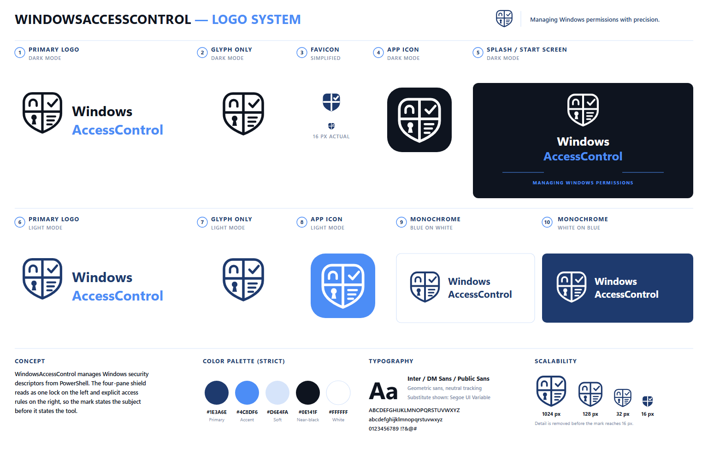

# Brand assets

Logo, icon, and colour assets for `WindowsAccessControl`, together with the
rules for using them. Link to a file in this folder rather than re-cropping or
recolouring the mark for a single document.

## The mark

The shield is split into four panes. The left column carries a shackle and a
keyhole, the right column a check mark and a rule list, so the mark reads as one
lock guarding a set of explicit access rules. It states the subject — a Windows
security descriptor — before it states the tool.

The tagline is *Managing Windows permissions with precision*.

## Colour palette

The palette is closed. Do not introduce a sixth colour, a gradient, or a
shadow.

| Role       | Hex       | Used for                                           |
| ---------- | --------- | -------------------------------------------------- |
| Primary    | `#1E3A6E` | Shield and wordmark ink on a light background      |
| Accent     | `#4C8DF6` | The word *AccessControl*, rules, app-icon fill     |
| Soft       | `#D6E4FA` | Tints and separators                               |
| Near-black | `#0E141F` | Dark-surface background, high-contrast ink         |
| White      | `#FFFFFF` | Light-surface background, ink on a dark background |

The wordmark is set in a geometric sans with neutral tracking: Inter, DM Sans,
or Public Sans. Segoe UI Variable is the acceptable substitute on Windows.

## Files

| File                          | Pixels    | Background  | Use for                                                       |
| ----------------------------- | --------- | ----------- | ------------------------------------------------------------- |
| `logo-wordmark-light.png`     | 1363×415  | transparent | Primary lockup on white or another light surface              |
| `logo-wordmark-dark.png`      | 1363×415  | transparent | Primary lockup on a dark surface                              |
| `logo-glyph-light.png`        | 930×971   | transparent | Shield alone on a light surface, when the name is already set |
| `logo-glyph-dark.png`         | 930×971   | transparent | Shield alone on a dark surface                                |
| `icon-256.png`                | 256×256   | transparent | Package and application icon, accent fill                     |
| `icon-dark-256.png`           | 256×256   | transparent | Package and application icon, near-black fill                 |
| `banner-light.png`            | 1536×1024 | `#FFFFFF`   | Title card, splash, or slide opener on light                  |
| `banner-dark.png`             | 1536×1024 | `#0E141F`   | Title card, splash, or slide opener on dark                   |
| `social-preview.png`          | 1280×640  | `#0E141F`   | The GitHub repository social preview                          |
| `logo-mono-blue-on-white.png` | 1254×1254 | `#FFFFFF`   | Single-colour reproduction, print, stickers                   |
| `logo-mono-white-on-blue.png` | 1254×1254 | `#1E3A6E`   | Single-colour reproduction on the primary colour              |
| `design-board.png`            | 1536×1024 | `#FFFFFF`   | The specimen sheet reproduced above                           |

## Choosing a variant

- Pick the variant that contrasts with the surface it sits on, not the one whose
    name matches the theme. `logo-wordmark-dark.png` is white ink *for* a dark
    surface.
- Serve both variants where the surface can change. In Markdown that means a
    `<picture>` element with a `prefers-color-scheme` source, which is how the
    project README renders its header.
- Below roughly 128 px, drop the wordmark and use the glyph. Below 32 px, use
    the icon. The mark loses its interior detail before it reaches 16 px, so do
    not scale the full lockup into a favicon.
- Keep clear space of at least the width of one shield pane on every side.
- Do not recolour, outline, rotate, skew, or stretch the mark, and do not place
    the transparent variants on a surface that leaves the ink below a 4.5:1
    contrast ratio.

## Where these assets are used

- The project [README](../README.md) renders the two wordmark variants through a
    `<picture>` element, so the header follows the reader's GitHub theme.
- `IconUri` in [`source/WindowsAccessControl.psd1`](../source/WindowsAccessControl.psd1)
    points at `icon-256.png` on the default branch, which is the icon the
    PowerShell Gallery shows for the package.
- `social-preview.png` is sized for the GitHub social preview, which is uploaded
    once under *Settings > General > Social preview*. It is not referenced from
    any file, so it must be re-uploaded by hand if the mark changes.

## Provenance

The specimen sheet, the two banners, and the two monochrome lockups are the
original renders, unmodified. The remaining files are derived from those
renders, and each derivation is mechanical rather than a redraw:

- The wordmark and glyph variants are cropped to the bounding box of their
    non-transparent pixels, with 24 px of padding for the wordmark and 16 px for
    the glyph. The originals carried more than half their area as empty space,
    which made them unusable at a fixed width.
- The dark-surface wordmark and glyph are recoloured, not redrawn. Every pixel
    closer to an ink colour (`#0E141F` or `#1E3A6E`) than to the accent
    (`#4C8DF6`) was set to white with its alpha preserved, which turns the
    anti-aliased edges white as well and leaves the accent word untouched.
- The two icons are cropped to the rounded square and resampled to 256 px with
    high-quality bicubic interpolation.
- The social preview is the dark banner scaled to 1280 px wide and cropped to
    1280×640, offset so the artwork stays centred. The banner background is a
    flat `#0E141F`, so the crop leaves no seam.

## See also

- [README](../README.md)
- [Usage guide](../docs/usage-guide.md)
